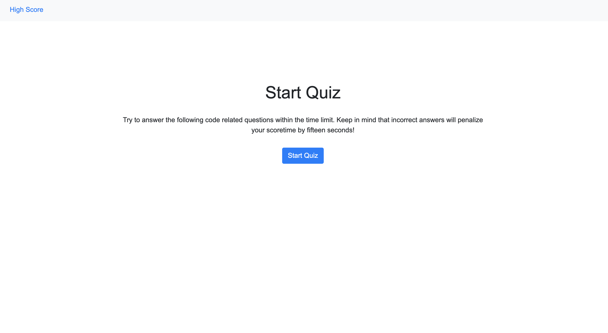
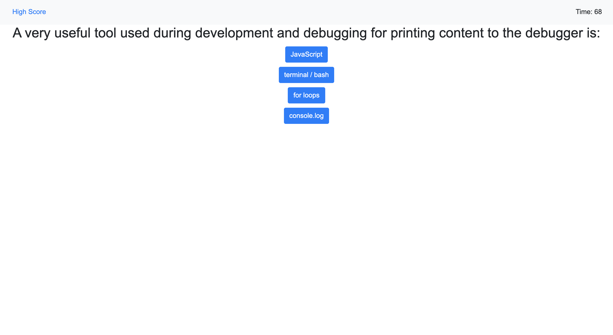
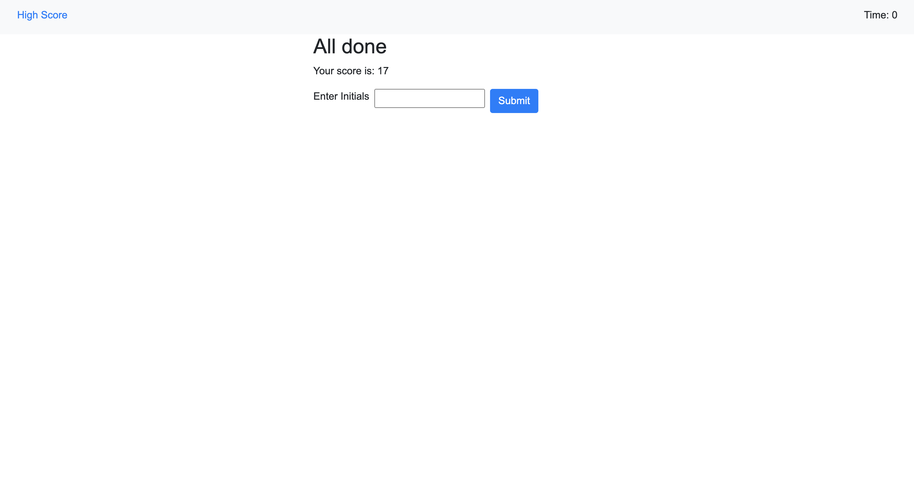
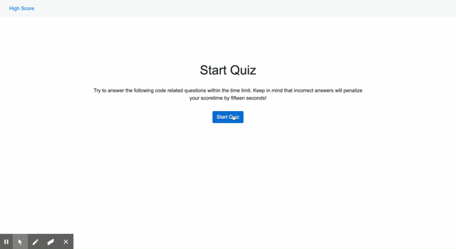

# ** Web APIs: Code Quiz**

## **Live Link**

https://kingkitty89.github.io/Quiz/

## **Contributors**

@KingKitty89

## **Description**

For this project I was given an example of a functioning multiple-choice quiz. I built a timed quiz comprable to the one I was shown. The quiz is powerd by HTML, CSS, and Javascript files that I created. The quiz takes the user through the questions that I have made. It tells the user when they have gotten a question correct or wrong as they go along. The application keeps the users score and reveals it at the end of the quiz. Once the quiz is complete the user is directed to a page where they can log their initials and the application will store the users high-scores. There are options to go back to the start of the quiz or to clear all of the high-scores.

video demo of working application: https://drive.google.com/file/d/1mNxJ9sptz9SAKzQVCNl9wMKvtry-s0j9/view

## **Technology Stack**
* HTML 
* CSS 
* JavaScript

## **Usage**

This website will allow the user to test their knowledge of coding fundamentals via a timed multiple-choice quiz.

## **Contact**
* #### **Name:** Jessica Helft (@KingKitty89)
* #### **Email:** [jessicahelft@gmail.com](jessicahelft@gmail.com)
* #### **LinkedIn:** https://www.linkedin.com/in/jessicahelft

## **Screenshots**

## **Tests**

